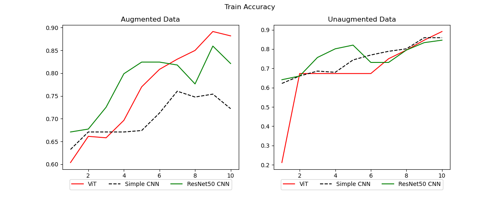
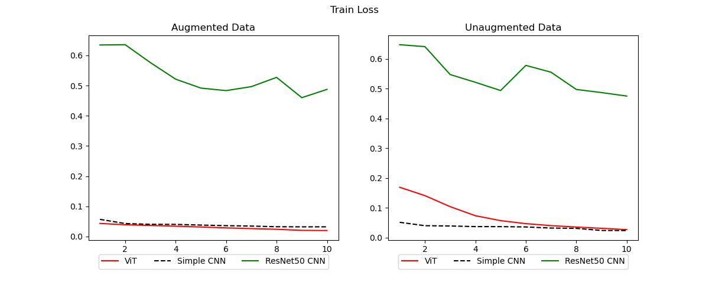
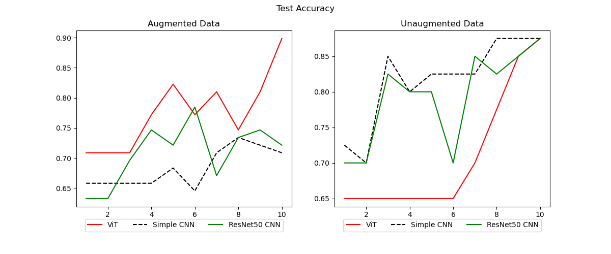
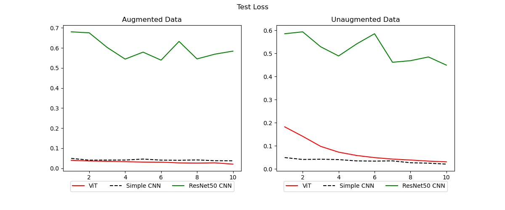

# Bighorn Population Classification using Visual Transformers

## Database
This project uses the dataset provided by Pellegrin et al. [^1].

## Results

### References
[^1]: Vargas-Felipe, M., Pellegrin, L., Guevara-Carrizales, A. A., López-Monroy, A. P., Escalante, H. J., & Gonzalez-Fraga, J. (2021). *Desert bighorn sheep (Ovis canadensis) recognition from camera traps based on learned features*. *Ecological Informatics*, 64, 101328. [https://doi.org/10.1016/j.ecoinf.2021.101328]
